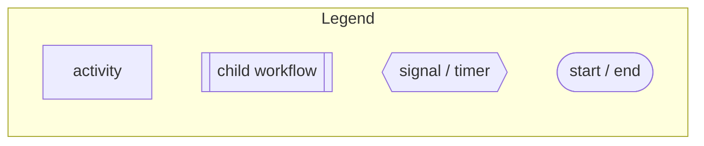
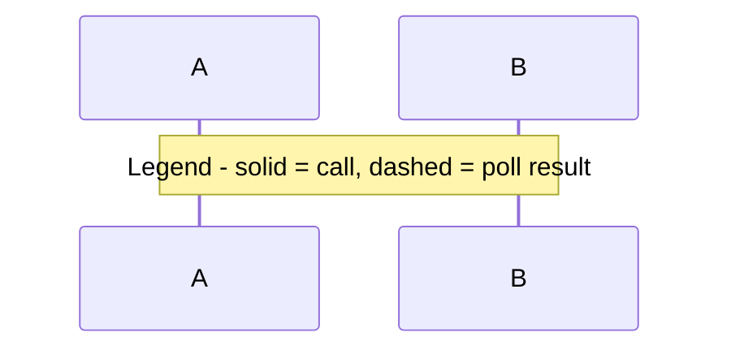

# Diagram guide

The bar: an SA seeing these diagrams for the first time can locate cost, risk, and scale bottlenecks *without asking what the boxes mean*. "4 boxes and lines" fails that bar and can get a review cancelled outright.

Two diagram types are required. They answer different questions; never merge them into one mega-diagram.

Every diagram must pass `scripts/lint_diagrams.py` (Phase 5). The rules below are what it checks.

**Declare the diagram's role on the first line** — `%% role: topology` or `%% role: workflow`. The linter requires it, and the node cap depends on it. It is a declaration and not an inference from the filename, so a topology diagram named `something-internal.mmd` still gets the topology cap.

## Mermaid safe subset (non-negotiable — this is what keeps diagrams renderable)

- **Quote every node label.** `api["Order API"]`, never `api[Order API]`. An unquoted label containing a comma, colon, parenthesis, slash, or a line break **fails to parse**, and you will not see the failure without a renderer.
- **Line breaks inside labels use ` `**, inside the quotes: `w1["billing-worker K8s, 3 replicas"]`. Never a literal newline in a label.
- **Never use HTML entities** (`&lt;`, `&gt;`, `&amp;`). They render literally as `&lt;`. Write a plain word instead: `"WF ID = temporal-sys-scheduler-ID"`, not `"...:&lt;id&gt;"`.
- **Quote every edge label:** `a -- "starts ChargeOrder" --> b`. An unlabeled edge is a question the SA has to ask — if you cannot label it, that is a gap-ledger entry, not a bare arrow.

## The legend must be in the canvas, not in a comment

A `%%` comment legend satisfies the letter of "every diagram has a legend" and **defeats its purpose**: comments vanish in the rendered PNG, which is the artifact that gets pasted into forms and decks. Put the legend in the diagram as a subgraph of shape samples:

**Sequence diagrams are the exception**, because Mermaid `sequenceDiagram` cannot contain a `subgraph`. There, use a note instead, and the linter accepts it:

Comments above the diagram are still useful for provenance (source paths, date) — just never for the legend.

## Diagram 1 — External architecture (exactly one)

*The system around Temporal.* Answers: where does Temporal sit, what feeds it, what does it call, where could cost, latency, or risk originate?

Must show:
- **Every workflow trigger source** (user-facing service, API, schedule/cron, event or queue consumer)
- **Worker topology:** each worker deployment as its own box, labeled with its task queue(s) and where it runs
- **Temporal itself** as one clearly-marked box — label Cloud or self-hosted
- **Every external system touched by activities**, each labeled with *what it is* ("Postgres — order state", "Stripe API"), never bare "DB"
- **Direction and a verb on every edge** ("starts workflow", "polls task queue", "writes manifest to S3")

Use `flowchart LR` with subgraphs for *your services*, *Temporal*, *workers*, and *external dependencies*.

**Hard cap: 25 nodes**, and over that, split into `external-architecture-<domain>.mmd` per domain — an unreadable diagram is a missing diagram.

**What counts toward the cap:** real components only. Subgraph containers and the legend's shape samples are scaffolding and are excluded, so the 25 is a genuine budget of 25 things in the system, not 25 lines of Mermaid.

## Diagram 2 — Internal workflow shape (one per in-focus workflow *or family*)

*The shape of the orchestration.* Answers: what are the steps, where are the waits, what happens on failure?

Must show, for that workflow: the trigger; major steps in order; each **activity**; **child workflows**; **signals/updates/queries** arriving from outside; **timers and waits**; **retry behavior** where it is deliberate; **failure paths** (compensation, saga rollback, terminal failure); **continue-as-new** if present; the final outcome(s). Draw failure paths as real edges, never a footnote.

Use `flowchart TD`, or a sequence diagram when inter-service back-and-forth is the point.

**Workflow families get one diagram, not one each.** When several workflows form a single chain (a parent plus children whose *inter-workflow* relationships — ParentClosePolicy, await-start-vs-await-result — are the point), draw the family as one diagram named for the family: `<family>-internal.mmd`. Splitting it destroys the very relationship worth reviewing.

**Internal and family diagrams are exempt from the 25-node cap**, and label-dense nodes are explicitly blessed here: carrying exact timeouts, retry policies, and policy values in the node is more useful to an SA than a clean-looking diagram that omits them. Past ~40 nodes, reconsider.

## Diagrams describe, they don't editorialize

Node and edge labels carry names, roles, and exact values — never assessments. `"BatchActivity start_to_close 20 years, retry unbounded"` is a good label; `"BatchActivity (risky timeout!)"` is not. No warning icons, no red-for-bad coloring, no "⚠" annotations. Use color and shape only to distinguish *kinds* of thing (activity, child workflow, signal, external system), as the legend declares.

## Uncertainty goes in the ledger, not the drawing

A component you inferred but could not verify gets a **gap-ledger entry**, not a dashed border or a `?`. The ledger carries the reason, what would close it, and who might know — a dashed line carries none of that, and the ledger is mandatory anyway. Keep the drawing to what you can state, and let the blank space be explicit in prose.

Same evidence rule as the report: observed, stated, or effective — nothing else.
