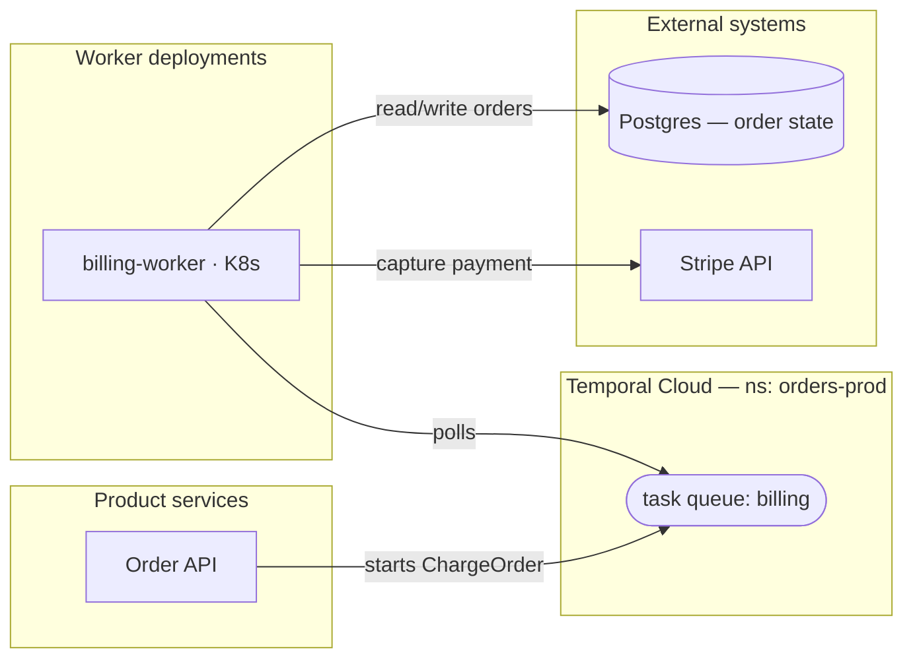

# Diagram guide (generic path)

The bar: an SA looking at these diagrams for the first time can locate cost, risk, and scale bottlenecks *without asking what the boxes mean*. "4 boxes and lines" fails that bar and can get a review cancelled. Two diagram types are required; they answer different questions and must not be merged into one mega-diagram.

Deliver each diagram as **both** Mermaid source (`.mmd`, editable) and a rendered image (`.png`/`.svg`) if a renderer is available (`mmdc`, or note in the share manifest that the `.mmd` renders at mermaid.live). The image is what gets pasted into forms and decks.

## Diagram 1 — External architecture (exactly one)

*The system around Temporal.* Answers: where does Temporal sit, what feeds it, what does it call, where could cost/latency/risk originate?

Must show:
- **Every workflow trigger source** (user-facing service, API, schedule/cron, event/queue consumer)
- **Worker topology**: each worker deployment as its own box, labeled with its task queue(s) and where it runs (K8s/VM/etc. if known)
- **Temporal itself** as one clearly-marked box (Cloud or self-hosted — label which)
- **Every external system touched by activities**: databases, caches, message queues, third-party APIs, internal services — each labeled with *what it is* ("Postgres — order state", "Stripe API"), not just "DB"
- **Data-flow direction** on every edge, with a short verb label ("starts workflow", "polls task queue", "writes manifest to S3")

Convention that reads well in Mermaid (`flowchart LR`): subgraphs for *your services*, *Temporal*, and *external dependencies*; one edge per real interaction. Example skeleton:

## Diagram 2 — Internal workflow shape (one per in-focus workflow)

*The shape of the orchestration.* Answers: what are the steps, where are the waits, what happens on failure?

Must show, for that workflow: the trigger; major steps in order; each **activity** (marked as such); **child workflows**; **signals/updates/queries** entering from outside; **timers/waits**; **retry behavior** where it's deliberate (a tuned policy, a capped retry); **failure paths** (compensation, saga rollback, terminal failure); **continue-as-new** if present; the final outcome(s).

Use `flowchart TD` (or a sequence diagram when inter-service back-and-forth is the point). Distinguish node kinds visually and say so in a **legend**: e.g. rectangles = activities, double-border = child workflows, hexagons = signals/timers, rounded = decisions. Show the failure path as real edges, not a footnote.

## Quality rules (both diagrams)

- **A legend on every diagram.** Never assume shape conventions are obvious.
- **Bounded size.** More than ~25 nodes: split (per-domain external diagrams; collapse a linear run of steps into one labeled node). An unreadable diagram is a missing diagram.
- **Label edges with verbs**, boxes with names + roles. An unlabeled arrow is a question the SA has to ask — if *you* can't label it, add it to the gap ledger.
- **Mark uncertainty in-line**: a component you inferred but couldn't verify gets a dashed border/`?` suffix and a gap-ledger entry. Never silently draw a guess as fact.
- **Only observed or stated content.** Same evidence rule as the report.
- **One hop out.** External diagram includes what workflows/activities/starters touch directly; anything further is one collapsed labeled box ("downstream analytics pipeline").
